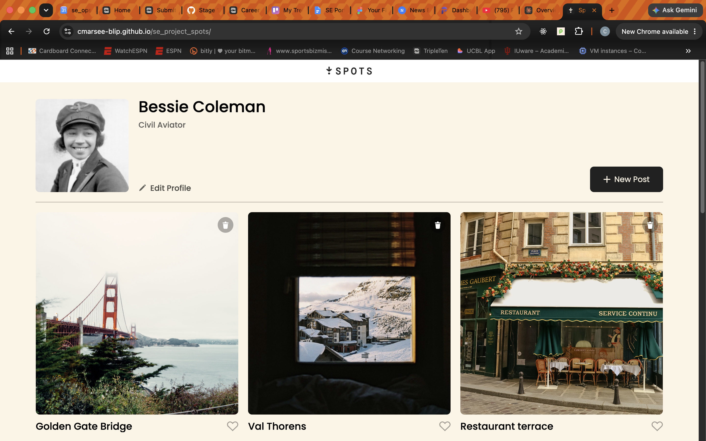
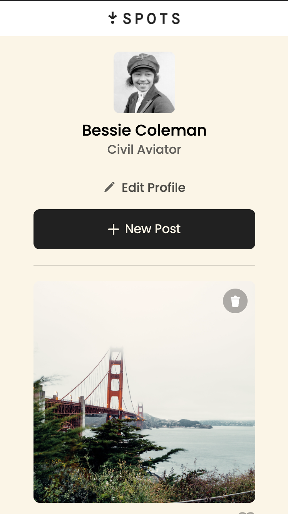

# Spots

A photo-sharing style page focused on responsive design, built as Project 3 of TripleTen's Software Engineering program.

🔗 **Live Demo:** [cmarsee-blip.github.io/se_project_spots](https://cmarsee-blip.github.io/se_project_spots/) &nbsp;|&nbsp; 🎥 **Demo Video:** CodyMarsee-ProjectPitch-SpotsStage2 https://drive.google.com/file/d/10F34bjf4XVamNnaNdHOzXgXSblM2vT-6/view?usp=sharing CodyMarsee-ProjectPitch-SpotsStage9: https://www.loom.com/share/1e309fdac93c48758a0ce95eb3398ab5

---

## 📖 Overview

Spots is the third project in the program, with a goal of demonstrating responsive design and media queries so the page looks appealing across devices and screen sizes, from mobile to desktop.

## 🛠️ What I Built & How

I built a photo-sharing style layout and used CSS media queries to adapt the layout, spacing, and image sizing across breakpoints, rather than designing for a single fixed viewport. Design specs were based on a provided Figma file.

**Key features:**
- Fully responsive layout using media queries
- Cross-device, cross-browser layout consistency
- Design implemented to match a Figma specification

**Built with:** HTML, CSS, JavaScript

## 🖼️ Screenshots




## ⚙️ Running It Locally

No build step required — clone the repo and open `index.html` directly in a browser.

```bash
git clone https://github.com/cmarsee-blip/se_project_spots.git
```

## ✅ Results

The page renders correctly across multiple device sizes and browsers, meeting the project's responsive-design goal. It's live and deployed via GitHub Pages.

## 🚀 Future Improvements

- Fix [add a specific limitation you noticed] using [your planned approach] to achieve [the outcome].
- Fix [add a specific limitation you noticed] using [your planned approach] to achieve [the outcome].
